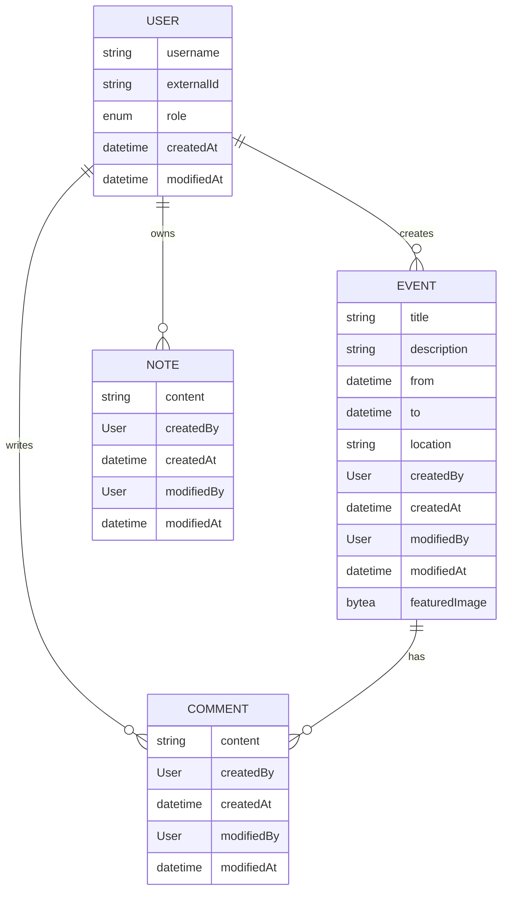

# cas-ssdd-2026-project

[](https://github.com/rufer7/cas-ssdd-2026-project/blob/main/LICENSE)

[](https://github.com/rufer7/cas-ssdd-2026-project/actions/workflows/ci-cd.yml)
[](https://github.com/rufer7/cas-ssdd-2026-project/actions/workflows/dependency-graph/auto-submission)
[](https://github.com/rufer7/cas-ssdd-2026-project/actions/workflows/dependabot/dependabot-updates)

[](https://sonarcloud.io/summary/new_code?id=rufer7_cas-ssdd-2026-project)
[](https://sonarcloud.io/summary/new_code?id=rufer7_cas-ssdd-2026-project)
[](https://sonarcloud.io/summary/new_code?id=rufer7_cas-ssdd-2026-project)
[](https://sonarcloud.io/summary/new_code?id=rufer7_cas-ssdd-2026-project)
[](https://sonarcloud.io/summary/new_code?id=rufer7_cas-ssdd-2026-project)
[](https://sonarcloud.io/summary/new_code?id=rufer7_cas-ssdd-2026-project)
[](https://sonarcloud.io/summary/new_code?id=rufer7_cas-ssdd-2026-project)
[](https://sonarcloud.io/summary/new_code?id=rufer7_cas-ssdd-2026-project)
[](https://sonarcloud.io/summary/new_code?id=rufer7_cas-ssdd-2026-project)
[](https://sonarcloud.io/summary/new_code?id=rufer7_cas-ssdd-2026-project)

Project for CAS Secure Software Design &amp; Development at ZHAW School of Engineering.

## TODOs

Design, develop, and secure a full-stack web application using a Java Spring Boot backend and an arbitrary frontend technology.

Implement a variety of security-relevant features, apply best practices in areas such as authentication, authorization, input validation, secure session management, and
protection against common web vulnerabilities.

### Required Features

- API
- Login functionality
- At least two distinct Roles (e.g., users and administrators)
- Secret user data (e.g., password, personal notes, etc.)
- File upload
- Blog / comment functionality (some kind of text input)
- Input-dependent database queries (e.g., search function)

## Project Description

This project targets the event management domain and is about the implementation of a secure full-stack event management application for two user groups: regular users and administrators. Regular users can authenticate, browse published events, search for relevant events, and write comments to events. Additionally, users can also create personal notes. Administrators have extended permissions to manage events including creating, updating, and deleting events (incl. featured image for events), while also having the same capabilities as regular users in terms of commenting and interacting with events.

The main focus of the application is on security aspects, ensuring that all functionalities are implemented with best practices in mind to protect against common web vulnerabilities. The deployed application will be pentested by the other students on the last day of the course.

## Requirements and Design Decisions

- API: The application will expose a RESTful API for all functionalities, allowing for easy integration with various frontend technologies
- Login functionality: Open ID Connect (OIDC) will be used for authentication, providing a secure and standardized way to manage user identities and access control via an external identity provider (i.e. Entra ID)
- Role-based access control (RBAC): The application will implement RBAC to differentiate between regular users and administrators, ensuring that only authorized users can access specific functionalities
- Secret user data: Personal notes created by users will be stored encrypted to ensure that sensitive information is protected at rest
- File upload: Administrators will be able to upload featured images for events, with proper validation and security measures in place to prevent malicious file uploads
- Blog/comment functionality: Users will be able to write comments on events, with input validation and sanitization to prevent XSS and other injection attacks
- Input-dependent database queries: The search functionality will be implemented with prepared statements to prevent SQL injection

### Domain Model



### Design Decisions

> [!NOTE]
> The following design decisions relate to the domain model and its implementation

- The `User` record will have an `externalId` field to store the unique identifier from the external identity provider (Entra ID), allowing for seamless integration with OIDC authentication
- The `Role` field in the `User` record will be an enum to clearly define the different user roles (`USER`, `ADMIN`) and facilitate role-based access control - `ADMIN` role includes user permissions
- The `Event` record acts as a aggregate root with `Comment` records being associated with it. This allows for a clear separation of concerns and encapsulation of related data
- The `Note` record is associated with the `User` record, allowing users to have their own personal notes that are not directly related to events
- All records will include `createdAt`, and `modifiedAt` fields to track the creation and modification history of each record
- All records except `User` will include `createdBy` and `modifiedBy` fields to track which user created or modified the record

## Technologies

- `Backend`: [Java Spring Boot](https://spring.io/projects/spring-boot)
- [OPTIONAL] `Frontend`: [Vue.js](https://vuejs.org/) or any other frontend technology of choice
- `Database`: [PostgreSQL](https://www.postgresql.org/)
- `Authentication`: [Open ID Connect (OIDC)](https://openid.net/connect/)
- `Identity Provider`: [Entra ID](https://www.microsoft.com/en-us/security/business/identity-access/microsoft-entra-id)
- `Hosting`: [Render](https://render.com/)
- `Version Control`: [GitHub](https://github.com/)
- `SAST`: [SonarQube Cloud](https://sonarcloud.io/)

## Getting Started

> [!IMPORTANT]
> Java 25 is required (see for example https://openjdk.org/install/)

### Standalone

To build the project and run the application locally, follow these steps:

1. Clone the repository to your local machine
1. Navigate to the project directory
1. Use the following commands to build and run the application

   ```bash
   .\gradlew build
   .\gradlew bootRun
   ```

Once the application is running, you can access the following URLs:

- http://localhost:8080/h2-console
- http://localhost:8080/api/events

### Docker

> [!IMPORTANT]
> Docker or a similar containerization tool is required to build and run the application using Docker.

To build the project and run the application locally using Docker, follow these steps:

1. Clone the repository to your local machine
1. Navigate to the project directory
1. Use the following commands to build and run the application

   ```bash
   docker build -t cas-ssdd-2026-project .
   docker compose up --build
   ```

Once the application is running, you can access the following URL:

- http://localhost:8080/api/events

## Update gradle.lockfile and verification-metadata.xml

To update the `gradle.lockfile` and `verification-metadata.xml` files, you can use the following commands:

```bash
./gradlew --write-verification-metadata sha256 dependencies
./gradlew build --write-locks
```
